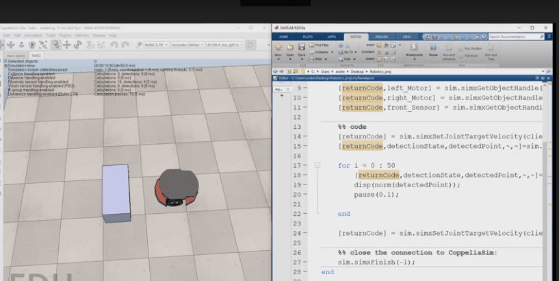

# Matlab Robot Simulation with V-REP
This project shows you how to connect Matlab to V-REP and how to send actuator commands, read proximity sensors, and transfer camera images between V-REP and Matlab.

# Demo

# Environment used 
V-rep & Matlab

# Steps
how to connect between v-rep (CoppeliaSim) and matlab : (verison 4)

    1. create a cuboid object inside CoppeliaSim
    2. create a script for the cuboid
    3. open the script and put "simRemoteApi.start(19999)" without quotes in the sysCall_init function
    4. go to the directory C:\Program Files\CoppeliaRobotics\CoppeliaSimEdu\programming\remoteApiBindings\matlab\matlab
    5. copy remoteApi.m , simpleTest.m , remoteApiProto.m to the projects' working directory of copeliaSim
    6. copy remoteApi.dll from C:\Program Files\CoppeliaRobotics\CoppeliaSimEdu\programming\remoteApiBindings\lib\lib\Windows to the working directory 
    7. run the simulation in coppeliaSim then run the matlab simpleTest.m file
    8. if all things went good u should see Simulation started,Hello CoppeliaSim! at coppeliaSim terminal and see the mouse position in matlab 

# Notes
There are some changes between binding v-rep 4 or v-rep 3
the locations and names of files may differ depending on the version you are using
    
